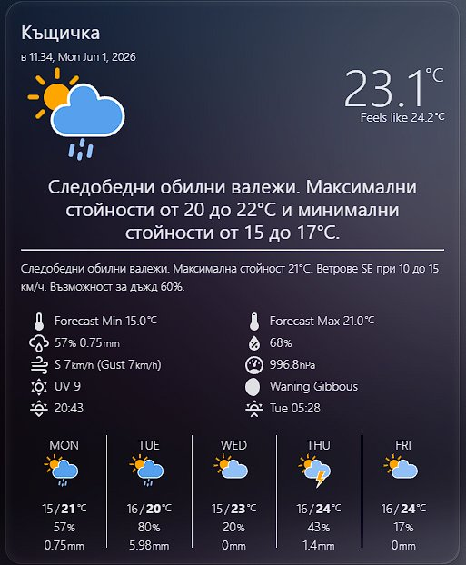
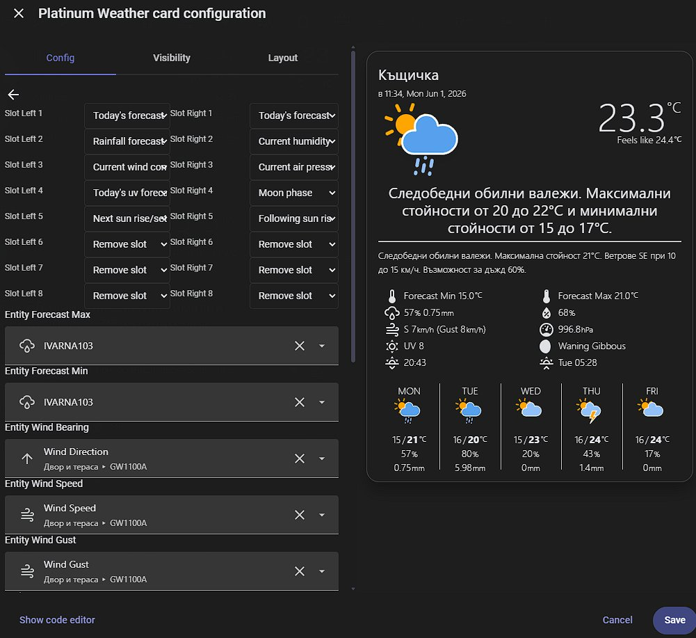
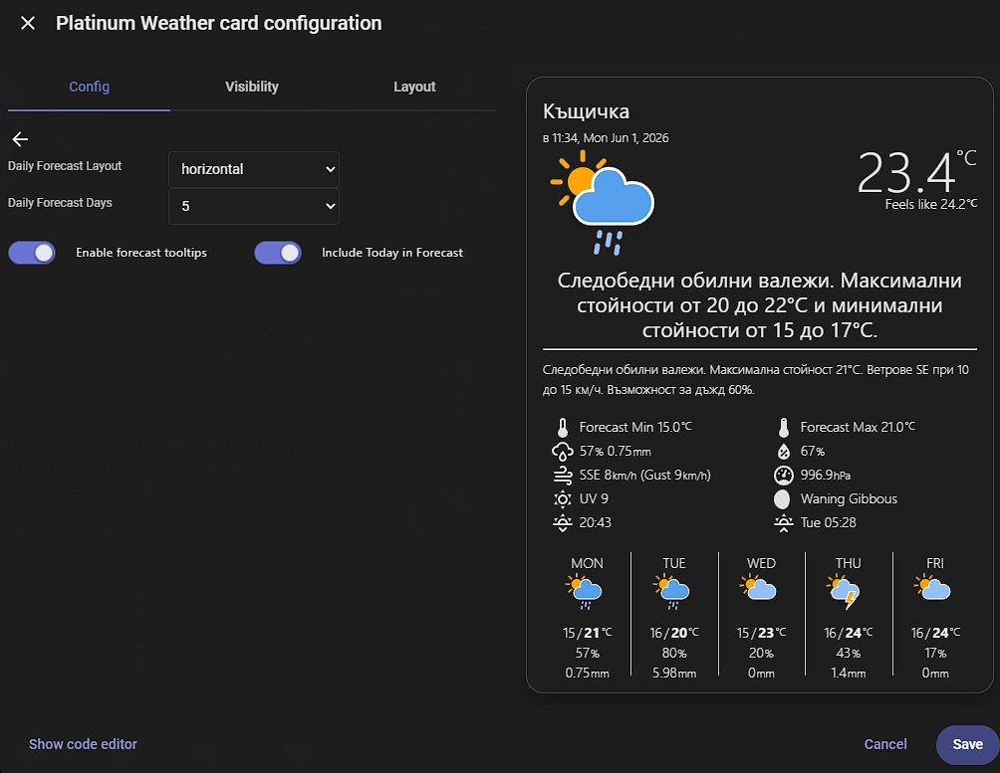
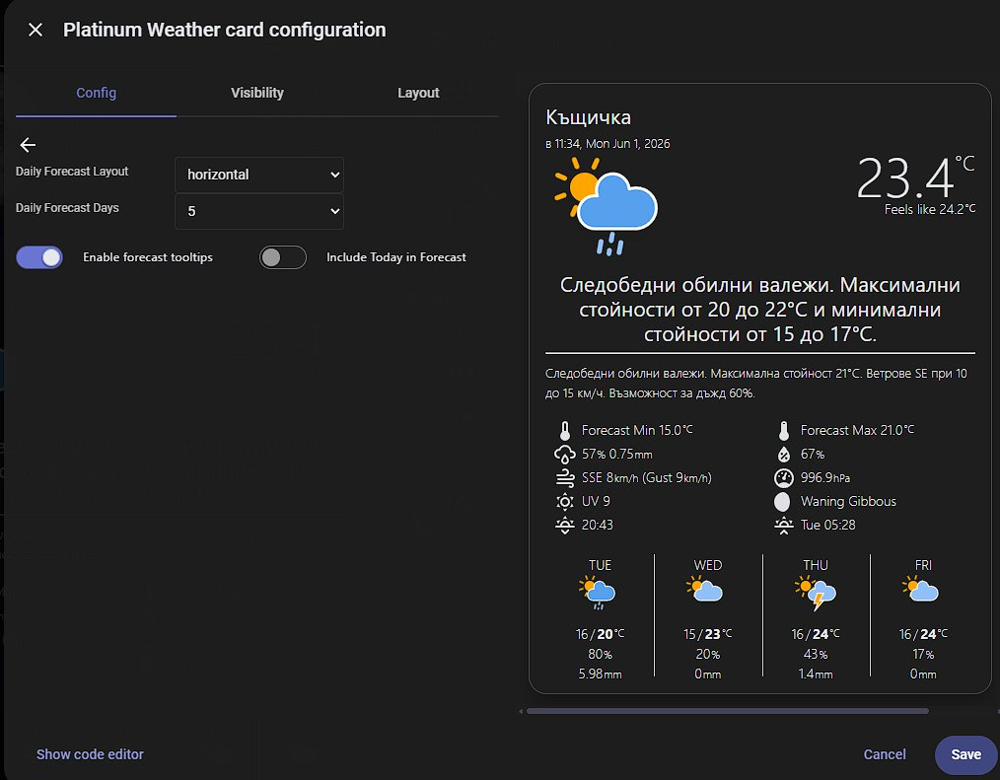

# Platinum Weather Card

A highly configurable weather card for Home Assistant with a graphical editor, now with an integrated temperature/precipitation chart section — a mashup of [Platinum Weather Card](https://github.com/tommyjlong/platinum-weather-card) and [Weather Chart Card](https://github.com/Makin-Things/weather-chart-card). Based on the original by [@makin-things](https://www.github.com/makin-things), extended by [@tommyjlong](https://github.com/tommyjlong), maintained and further developed here by [@rudizl](https://github.com/rudizl).

Both source cards had gone largely unmaintained, yet they remain arguably the best options available for people running personal weather stations with Home Assistant. Rather than maintaining two separate cards with overlapping functionality, this fork merges the best of both.

[](https://github.com/custom-components/hacs)
[![GitHub Release][releases-shield]][releases]
[![License][license-shield]](LICENSE.md)


## Installation

Install via HACS as a custom repository:

1. In HACS → Frontend → ⋮ → Custom Repositories
2. Add `https://github.com/rudizl/platinum-weather-card-plus-charts` → type **Lovelace**
3. Install **Platinum Weather Card**
4. Hard-refresh your browser

---

<details>
<summary><strong>Changelog — v2.0.0 preview</strong></summary>

**v2.0.0-preview.50** *(current)*

**New: Charts Section** (merged from Weather Chart Card)
- Temperature lines (max/min) rendered as continuous polylines below the daily forecast
- Precipitation bars with millimetre labels, scaled to the day with highest rainfall
- Configurable independently: toggle temperature chart and precipitation chart separately
- `section_order` support — Charts appears as its own section, reorderable in the editor
- `show_section_charts`, `option_show_temperature_chart`, `option_show_precipitation_chart` config keys

**New: Hover Tooltips**
- CSS `:hover` tooltips on both **forecast columns** and **chart columns** — identical content in both places
- Shows: date (bold), weather description (from `entity_summary_1` sensor), **↑ max°** (red), **↓ min°** (blue), 💧 precipitation, wind direction arrow + speed
- Dark background (`rgba(10,20,40,0.96)`), white text — readable on any dashboard theme
- Wind unit read directly from `weather.*` entity attributes (never falls back to HA system `m/s` for entities that report in `km/h`)
- Units localized to HA app language (`km/h` → `км/ч`, `mm` → `мм` for Bulgarian, etc.)
- Tooltip width spans the full section width, matching forecast section behaviour

**New: Icon Packs**
- `meteocons-fill` / `meteocons-line` — [Meteocons](https://github.com/basmilius/weather-icons) by Bas Milius (MIT, loaded from jsDelivr CDN)
- `wcc-2` — [amCharts Weather Icons](https://www.amcharts.com/free-animated-svg-weather-icons/) via `rudizl/weather-chart-card` (CC BY 4.0)
- `custom` — any icon set via `icon_pack_path` with `{condition}` placeholder
- Selectable from the editor's **Global Options** → **Icon Pack** dropdown

**Editor overhaul**
- Lock/unlock icons for section visibility toggles (replacing `ha-switch`)
- MDI section icons throughout (`mdi:eye-outline`, `mdi:text-box-outline`, `mdi:view-grid-outline`, `mdi:calendar-week`, `mdi:chart-line`, `mdi:cog`)
- Global Options moved to the top of the editor
- Dropdown option translations (EN + BG: daily/hourly/twice_daily, horizontal/vertical, 12h/24h/system)
- i18n framework with 112 translated strings — EN and BG complete

**Other**
- `option_show_current_day` — include today in the forecast/chart strip instead of starting from tomorrow
- Config validation in `setConfig` — required fields, entity ID format, `section_order` values, `daily_forecast_days` range
- Wind forecast data in chart (bearing + speed available to tooltip)
- HA 2026.5/2026.6 compatibility: `ha-textfield` → `ha-input`, WebAwesome switch tokens, `ha-switch` removal

</details>

<details>
<summary><strong>Changelog — Stable releases</strong></summary>

**v1.3.1-beta.13**
- Hide `unknown`/`unavailable` state in the extended forecast section — was showing raw `unknown` text below the separator line when the entity was unavailable

**v1.3.1-beta.12**
- Fix false-positive errors for sensor entities with multi-digit numbers in their names (e.g. `sensor.ivarna103_*`) — the card no longer checks if an auto-incremented entity name exists, eliminating spurious `'entity_pop'+'1'=...not found` warnings
- Add optional label field to custom slots (custom1–4) — set `custom1_label: 'My label'` to display a small secondary text before the entity value; configurable via the editor

**v1.3.1-beta.11**
- Add `option_show_current_day` — new toggle **"Include Today in Forecast"** in the editor (Daily Forecast section); when enabled, the forecast strip starts from today instead of tomorrow

**v1.3.1-beta.9**
- Show `---` instead of `NaN%` / `unknownmm` when a sensor entity returns `unknown` or `unavailable` — affects humidity, rainfall, pressure, visibility, wind speed/gust, and precipitation slots

**v1.3.1-beta.4**
- Add `getEntitySuggestion` — card appears in the HA 2026.6+ card picker under "Community" when a `weather.*` entity is selected, pre-filling `weather_entity` in the config

**v1.3.1-beta.3**
- Fix `fireDanger` variable scoping in vertical forecast layout
- Add `check: false` to TypeScript plugin to resolve build-time redeclaration error

**v1.3.1-beta.2**
- Remove `resize-observer-polyfill` dependency (~30KB bundle saving; all HA-supported browsers have had native `ResizeObserver` since 2020)
- Add missing `entity_moon` to TypeScript `WeatherCardConfig` interface
- Remove `ha-textfield` from editor CSS (officially removed in HA 2026.5)
- Remove stale TODO comments and old attribution comments

**v1.3.1-beta.1**
- Fix editor switch color — replace removed HA 2026.5 MDC tokens (`--mdc-theme-secondary`, `--switch-checked-color`) with new WebAwesome tokens (`--ha-switch-checked-background-color`, `--ha-switch-checked-thumb-background-color`)
- Migrate all editor text inputs from deprecated `ha-textfield` to `ha-input` (HA 2026.5+ compatible)
- Update editor loading guard to detect both `ha-input` and `ha-textfield`
- Remove dead `mwc-select` CSS rule (unused since v1.2.4)

**v1.3.0**
- Fix all card editor dropdowns not showing saved values
- Fix rainy/pouring icon associations
- Add `moon` slot with dynamic phase icons and translations (11 locales)
- Add `option_forecast_decimals`, `option_show_forecast_pop`
- Add `currentWindSpeedUnit` — reads wind unit from weather entity attributes
- Add Spanish (`es`) locale
- HA profile integration for time/date format
- Single-file build

**v1.2.4**
- Definitive fix for broken editor dropdowns — replaced all `ha-select`/`ha-list-item` with native `<select>` elements

**v1.2.3**
- Fix editor dropdowns — `mwc-list-item` removed in HA 2024.x, replaced with `ha-list-item`

**v1.2.2**
- Fix all dropdowns in the card editor not working in newer HA versions

**v1.2.1**
- Add `double_tap_action` support
- Add `Gust` localization for all supported languages
- Accept `hourly` and `twice_daily` as valid `forecast_type` values
- Fix broken layout in slots section, malformed HTML in beaufort wind display

</details>

---

## Screenshots

<table>
<tr>
<td align="center" width="50%">

**Card overview**



</td>
<td align="center" width="50%">

**Slot configuration in editor**



</td>
</tr>
<tr>
<td align="center">

**Include Today in Forecast — ON**



</td>
<td align="center">

**Include Today in Forecast — OFF**



</td>
</tr>
</table>

---

# Sections

- Overview
- Extended
- Slots
- Daily Forecast
- **Charts** *(new in v2.0.0-preview)*

Use the lock icon on each section header to hide it entirely, and the up/down buttons to reorder them. The **Global Options** section contains settings that affect multiple sections.

## Overview Section

Four layout options are available:

| Layout | Preview |
|--------|---------| 
| **Complete** |  |
| **Observations** |  |
| **Forecast** |  |
| **Title Only** |  |

| Option | Type | Description |
| ------ | ---- | ----------- |
| Card Title Text Line 1 | String | Optional title line 1 |
| Card Title Text Line 2 | String | Optional title line 2 |
| Entity Update Time | Entity | Entity providing the timestamp (RFC 3339 format) |
| &nbsp;&nbsp;Use Attribute | Boolean | Use an attribute of the above entity for the timestamp |
| &nbsp;&nbsp;Attribute | String | The attribute containing the timestamp |
| Update Time Prefix | String | Text to prepend to the timestamp |
| Entity Current Temperature | Entity | Current temperature |
| Entity Apparent Temperature | Entity | Apparent / feels-like temperature |
| Entity Forecast Icon | Entity | Entity whose state drives the condition icon |
| Entity Forecast Summary | Entity | Entity whose state is shown as the condition text |

## Extended Section

Shows today's detailed forecast text.

| Option | Type | Description |
| ------ | ---- | ----------- |
| Entity Extended Forecast | Entity | Entity providing the detailed forecast |
| &nbsp;&nbsp;Use Attribute | Boolean | Use an attribute of the entity instead of its state |
| &nbsp;&nbsp;Attribute | String | The attribute containing the forecast text |
| Entity Today's UV Forecast | String | Optional entity appended to the extended forecast |
| Entity Today's Fire Danger | String | Optional entity appended to the extended forecast |

## Slots Section

Up to 8 rows of data in 2 columns. The required entities update dynamically based on which slots are selected.

| Slot Value | Description | Example |
| ---------- | ----------- | ------- |
| `humidity` | Current humidity | 36% |
| `rainfall` | Today's recorded rainfall | 5mm |
| `pressure` | Current air pressure | 1018hPa |
| `wind` | Wind direction, speed and gust | SSE 9km/h (Gust 13km/h) |
| `wind_kt` | Wind in knots | SSE 5Kt (Gust 6Kt) |
| `visibility` | Current visibility | 70km |
| `observed_max` | Today's observed maximum | Observed Max 19°C |
| `observed_min` | Today's observed minimum | Observed Min 4°C |
| `forecast_max` | Today's forecast maximum | Forecast Max 19°C |
| `forecast_min` | Today's forecast minimum | Forecast Min 1°C |
| `temp_next` | Next min or max | Overnight Min 4°C |
| `temp_following` | Following min or max | Tomorrow's Max 20°C |
| `temp_maximums` | Observed and forecast max | Obs Max 15°C (Fore 19°C) |
| `temp_minimums` | Observed and forecast min | Obs Min 13°C (Fore 1°C) |
| `sun_next` | Next sunrise or sunset | 7:10pm |
| `sun_following` | Following sunrise or sunset | Mon 6:35am |
| `moon` | Moon phase with dynamic icon and translated name | Растяща луна |
| `pop` | Chance of rain | 10% |
| `popforecast` | Rainfall forecast | 10% - 3 to 6mm |
| `possible_today` | Forecast rain today | Forecast 15-25mm |
| `possible_tomorrow` | Forecast rain tomorrow | Fore Tom 5-10mm |
| `uv_summary` | UV forecast | UV High |
| `fire_danger` | Fire danger | Moderate |
| `custom1`–`custom4` | Custom entity with icon and unit | |
| `empty` | Blank slot (preserves space) | |
| `remove` | Remove slot entirely | |

## Icon Packs

The card supports multiple icon packs, selectable from the editor's **Global Options → Icon Pack** dropdown.

| Value | Description | Requirement |
|---|---|---|
| `default` | Built-in animated SVG icons (bundled with the card) | None |
| `meteocons-fill` | [Meteocons](https://github.com/basmilius/weather-icons) by Bas Milius — filled style | Internet (jsDelivr CDN) |
| `meteocons-line` | [Meteocons](https://github.com/basmilius/weather-icons) by Bas Milius — line style | Internet (jsDelivr CDN) |
| `wcc-2` | [ammap Weather Icons](https://www.ammap.com/) — included in `rudizl/weather-chart-card` | Install `rudizl/weather-chart-card` via HACS |
| `custom` | Any icon set — set `icon_pack_path` with `{condition}` placeholder | User-provided |

> **Note:** `wcc-1` has been removed — it was byte-for-byte identical to the Meteocons Fill pack. Use `meteocons-fill` instead.

For `custom`, set `icon_pack_path` to a path template such as `/local/my-icons/{condition}.svg`. The `{condition}` placeholder is replaced with the HA weather condition name (e.g. `clear-day`, `partlycloudy`, `rain`).

### Third-party icon licenses

| Icon pack | Author | License |
|---|---|---|
| [basmilius/weather-icons](https://github.com/basmilius/weather-icons) (Meteocons) | [Bas Milius](https://bas.dev) | [MIT](https://github.com/basmilius/weather-icons/blob/master/LICENSE) |
| [amCharts Weather Icons](https://www.amcharts.com/free-animated-svg-weather-icons/) (via `rudizl/weather-chart-card`, `wcc-2`) | amCharts / ammap.com | [CC BY 4.0](https://creativecommons.org/licenses/by/4.0/) — free including commercial use, attribution required |

> **Note:** The card's **default built-in icons** are also based on amCharts weather icons, extended by [@makin-things](https://github.com/Makin-Things/weather-icons).

## Daily Forecast Section

Two layout options: **Horizontal** (default, up to 5 days) and **Vertical** (up to 7 days).

Hovering over any forecast day column shows a tooltip with date, weather description, max/min temperatures, precipitation, and wind speed/direction. The tooltip content is identical to the Charts section tooltip.

| Option | Type | Description |
| ------ | ---- | ----------- |
| Weather Entity with Forecasts | String | Main weather entity for forecast data |
| Forecast Type | String | `daily`, `hourly`, or `twice_daily` |
| Entity Forecast Icon 1 | String | Entity for forecast condition icon |
| Entity Forecast Summary 1 | String | Entity for forecast summary text (also used in hover tooltips) |
| Entity Forecast Min 1 | String | Forecast minimum temperature |
| Entity Forecast Max 1 | String | Forecast maximum temperature |
| Entity Forecast Chance of Rain 1 | String | Precipitation probability |
| Entity Forecast Possible Rain 1 | String | Estimated rainfall amount |
| Entity Extended Forecast 1 | String | Detailed forecast text (vertical only) |
| Entity Fire Danger 1 | String | Fire danger forecast (vertical only) |

## Charts Section *(new in v2.0.0-preview)*

An integrated chart rendered directly below the daily forecast, showing the same days as the forecast strip.

| Option | Type | Description |
| ------ | ---- | ----------- |
| Show Temperature Chart | Boolean | Show max/min temperature polylines |
| Show Precipitation Chart | Boolean | Show precipitation bars with mm labels |

The chart uses the same weather entity forecast subscription as the daily forecast section. No additional entities are required.

Hovering over any chart column shows the same tooltip as hovering over the corresponding forecast column.

## Global Options

| Option | Type | Description |
| ------ | ---- | ----------- |
| Icon Pack | String | `default`, `meteocons-fill`, `meteocons-line`, `wcc-2`, or `custom` |
| Icon Pack Path | String | Path template for `custom` icon pack (e.g. `/local/icons/{condition}.svg`) |
| Show Static Icons | Boolean | Disable animated icons |
| Time Format | String | `system` (follows HA Settings → Profile), `12hour`, or `24hour` |
| Locale | String | Locale for timestamp and moon phase formatting. Supported: `bg`, `ru`, `ua`, `de`, `fr`, `it`, `nl`, `pl`, `da`, `es`, `he` |
| Include Today in Forecast | Boolean | Start the daily forecast and chart strips from today instead of tomorrow |

---

# YAML Reference

Almost all settings can be configured in the GUI editor. The YAML reference below is for advanced use or bulk configuration. Access it via **Show Code Editor** in the card editor.

## Global Settings

| Variable | Type | Default | Description |
| -------- | ---- | ------- | ----------- |
| `type` | String | — | Must be `custom:platinum-weather-card-plus-charts` |
| `section_order` | List | overview, extended, slots, daily_forecast, charts | Section display order |
| `show_section_overview` | Boolean | `true` | Show/hide overview section |
| `show_section_extended` | Boolean | `true` | Show/hide extended section |
| `show_section_slots` | Boolean | `true` | Show/hide slots section |
| `show_section_daily_forecast` | Boolean | `true` | Show/hide daily forecast section |
| `show_section_charts` | Boolean | `true` | Show/hide charts section |
| `tap_action` | Action | none | Action on tap |
| `hold_action` | Action | none | Action on hold |
| `double_tap_action` | Action | none | Action on double-tap |
| `option_static_icons` | Boolean | `false` | Use non-animated icons |
| `icon_pack` | String | `default` | Icon pack: `default`, `meteocons-fill`, `meteocons-line`, `wcc-2`, `custom` |
| `icon_pack_path` | String | — | Path template for custom icon pack |

## Actions

The card supports all standard [HA actions](https://www.home-assistant.io/dashboards/actions/). Some examples:

```yaml
# Tap — show more-info for a specific entity
tap_action:
  action: more-info
entity: weather.my_weather

# Hold — navigate to another dashboard view
hold_action:
  action: navigate
  navigation_path: /lovelace/misc

# Double-tap — toggle a light
double_tap_action:
  action: call-service
  service: light.toggle
  target:
    entity_id: light.living_room
```

| `option_time_format` | String | `system` | `system` (follows HA Settings → Profile), `12hour` or `24hour` |
| `option_locale` | String | none | Locale for timestamp and moon phase: `bg`, `ru`, `ua`, `de`, `fr`, `it`, `nl`, `pl`, `da`, `es`, `he` |
| `text_update_time_prefix` | String | none | Prefix for the update time display |

## Overview Settings

| Variable | Type | Default | Description |
| -------- | ---- | ------- | ----------- |
| `overview_layout` | String | `complete` | `complete`, `observations`, `forecast` or `title only` |
| `option_show_overview_decimals` | Boolean | `false` | Show 1 decimal on current/apparent temperature |
| `option_show_overview_separator` | Boolean | `false` | Show separator below overview section |
| `text_card_title` | String | none | Title line 1 |
| `text_card_title_2` | String | none | Title line 2 |
| `entity_update_time` | String | none | Entity providing the update timestamp |
| `update_time_use_attr` | Boolean | `false` | Use attribute for the timestamp |
| `update_time_name_attr` | String | none | Attribute name for the timestamp |
| `entity_temperature` | String | none | Current temperature entity |
| `entity_apparent_temp` | String | none | Apparent temperature entity |
| `entity_forecast_icon` | String | none | Forecast icon entity |
| `entity_summary` | String | none | Forecast summary entity |

## Extended Section

| Variable | Type | Default | Description |
| -------- | ---- | ------- | ----------- |
| `entity_extended` | String | none | Extended forecast entity |
| `extended_use_attr` | Boolean | `false` | Use attribute of the entity |
| `extended_name_attr` | String | none | Attribute name |
| `entity_todays_uv_forecast` | String | none | UV forecast entity |
| `entity_todays_fire_danger` | String | none | Fire danger entity |

## Slots Section

| Variable | Type | Default | Description |
| -------- | ---- | ------- | ----------- |
| `slot_l1`–`slot_l8` | Slot | see below | Left column slots 1–8 |
| `slot_r1`–`slot_r8` | Slot | see below | Right column slots 1–8 |
| `entity_pop` | String | none | Required for `pop`, `popforecast` |
| `entity_pos` | String | none | Required for `popforecast`, `possible_today` |
| `entity_possible_tomorrow` | String | none | Required for `possible_tomorrow` |
| `entity_rainfall` | String | none | Required for `rainfall` |
| `entity_humidity` | String | none | Required for `humidity` |
| `entity_pressure` | String | none | Required for `pressure` |
| `pressure_units` | String | none | Optional pressure unit label |
| `entity_observed_max` | String | none | Required for `observed_max`, `temp_maximums` |
| `entity_observed_min` | String | none | Required for `observed_min`, `temp_minimums` |
| `entity_forecast_max` | String | none | Required for `forecast_max`, `temp_maximums` |
| `entity_forecast_min` | String | none | Required for `forecast_min`, `temp_minimums` |
| `entity_temp_next` | String | none | Required for `temp_next` |
| `entity_temp_next_label` | String | none | Required for `temp_next` |
| `entity_temp_following` | String | none | Required for `temp_following` |
| `entity_temp_following_label` | String | none | Required for `temp_following` |
| `entity_uv_alert_summary` | String | none | Required for `uv_summary` |
| `entity_fire_danger` | String | none | Required for `fire_danger` |
| `entity_wind_bearing` | String | none | Required for `wind`, `wind_kt` |
| `entity_wind_speed` | String | none | Required for `wind`; wind speed unit is read automatically from the weather entity attributes |
| `entity_wind_gust` | String | none | Required for `wind` |
| `entity_wind_speed_kt` | String | none | Required for `wind_kt` |
| `entity_wind_gust_kt` | String | none | Required for `wind_kt` |
| `entity_visibility` | String | none | Required for `visibility` |
| `entity_sun` | String | none | Required for `sun_next`, `sun_following` |
| `entity_moon` | String | none | Required for `moon` (HA Moon integration sensor) |
| `custom1_value`–`custom4_value` | String | none | Entity for custom slot |
| `custom1_icon`–`custom4_icon` | Icon | none | MDI icon for custom slot |
| `custom1_units`–`custom4_units` | String | none | Unit label for custom slot |
| `custom1_label`–`custom4_label` | String | none | Optional text label shown before the value |
| `option_today_temperature_decimals` | Boolean | `false` | 1 decimal on temperature slots |
| `option_today_rainfall_decimals` | Boolean | `false` | 1 decimal on rainfall slots |
| `option_forecast_decimals` | Boolean | `false` | 1 decimal on forecast temperatures |
| `option_show_forecast_pop` | Boolean | `true` | Show precipitation probability in forecast |
| `option_pressure_decimals` | Number | `0` | Decimal places for pressure: `0`–`3` |
| `option_color_fire_danger` | Boolean | `true` | Colour fire danger by severity |

Default slot values: l1=`forecast_max`, l2=`forecast_min`, l3=`wind`, l4=`pressure`, l5=`sun_next`, l6–l8=`remove`, r1=`popforecast`, r2=`humidity`, r3=`uv_summary`, r4=`moon`, r5=`sun_following`, r6–r8=`remove`.

## Daily Forecast Section

| Variable | Type | Default | Description |
| -------- | ---- | ------- | ----------- |
| `weather_entity` | String | — | Main weather entity for forecasts |
| `forecast_type` | String | `daily` | `daily`, `hourly`, or `twice_daily` |
| `daily_forecast_layout` | String | `horizontal` | `horizontal` or `vertical` |
| `daily_forecast_days` | Number | `5` | Days to show: 1–5 (horizontal), 1–7 (vertical) |
| `option_tooltips` | Boolean | `false` | Enable hover tooltips on horizontal forecast columns |
| `option_show_current_day` | Boolean | `false` | Include today in forecast strip |
| `entity_summary_1` | String | none | Weather summary sensor for day 1 tooltip (auto-incremented for each day) |
| `daily_extended_forecast_days` | Number | `7` | Extended forecast days (vertical only, 0–7) |
| `option_daily_color_fire_danger` | Boolean | `true` | Colour fire danger (vertical only) |
| `old_daily_format` | Boolean | `false` | Stack max/min vertically instead of side by side |
| `tempformat` | String | — | `highlow` = show max before min |

## Charts Section

| Variable | Type | Default | Description |
| -------- | ---- | ------- | ----------- |
| `show_section_charts` | Boolean | `true` | Show/hide the charts section |
| `option_show_temperature_chart` | Boolean | `true` | Show max/min temperature lines |
| `option_show_precipitation_chart` | Boolean | `true` | Show precipitation bars |

The chart uses the same `weather_entity` and `daily_forecast_days` settings as the Daily Forecast section. No additional entities are required.

[license-shield]: https://img.shields.io/github/license/rudizl/platinum-weather-card-plus-charts.svg?style=for-the-badge
[releases-shield]: https://img.shields.io/github/release/rudizl/platinum-weather-card-plus-charts.svg?style=for-the-badge
[releases]: https://github.com/rudizl/platinum-weather-card-plus-charts/releases
